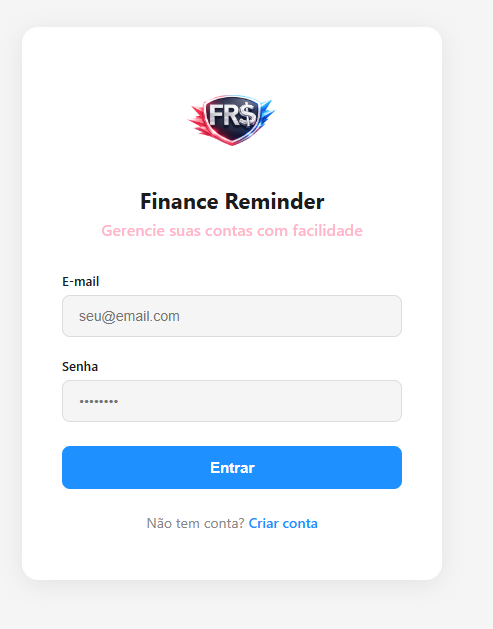
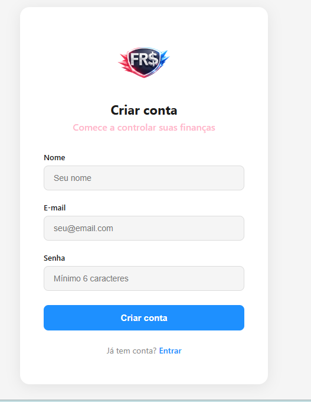
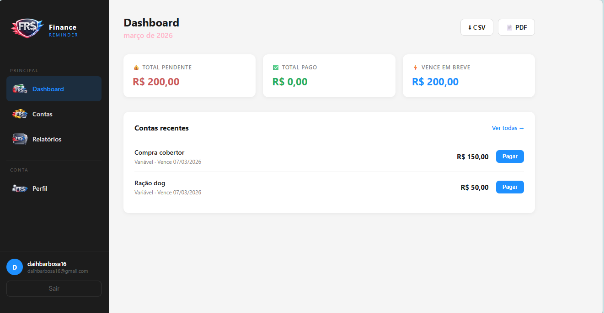
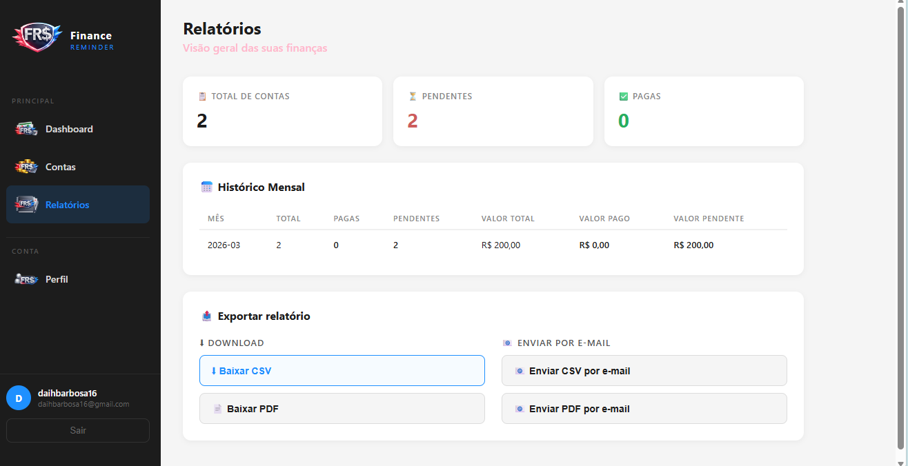
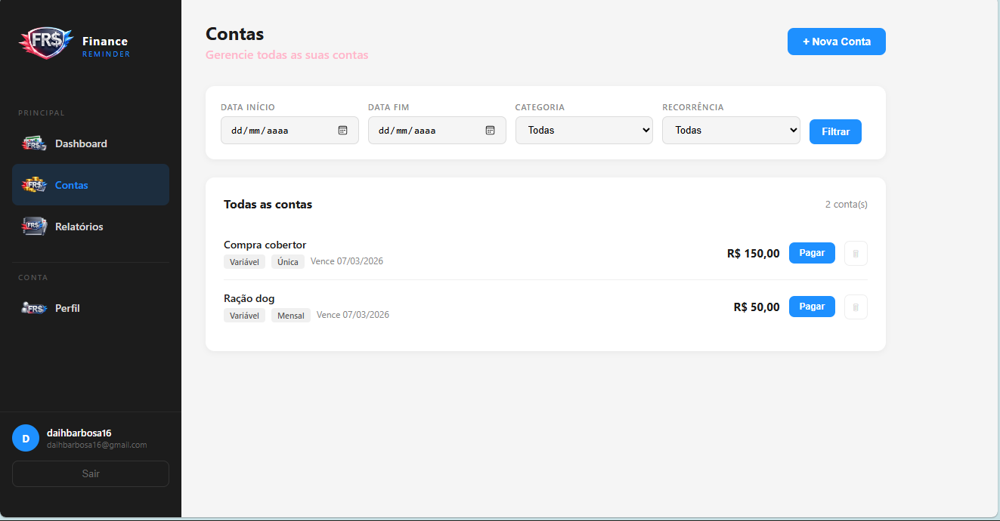
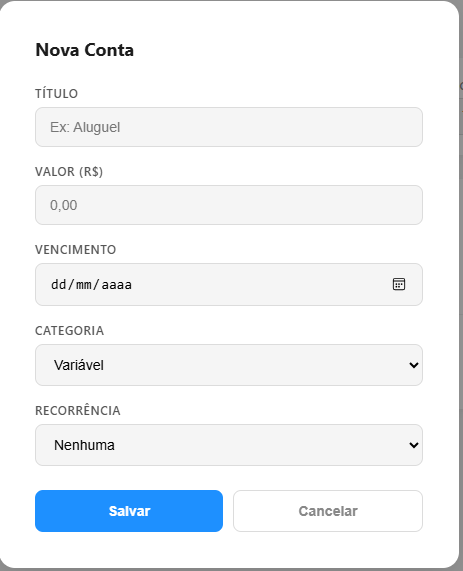
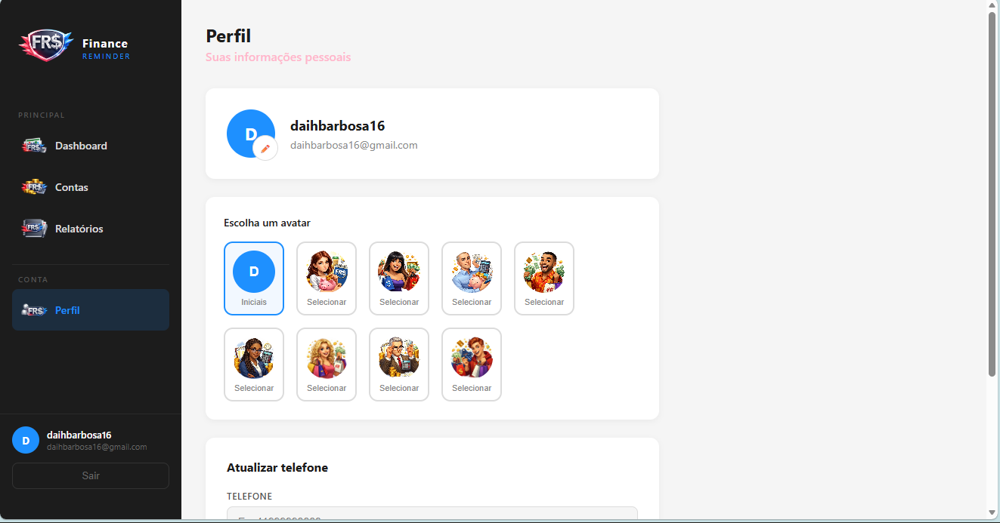
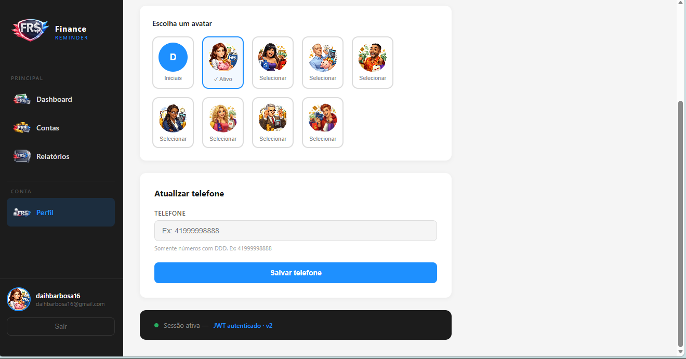

# 💰 Finance Reminder — Frontend

> Interface web para gerenciamento de contas e despesas, integrada à [Finance Reminder API](https://github.com/DaihSeven/finance-reminder-api).

---

## 🔗 Links

| | |
|---|---|
| 🌐 **Deploy** | [finance-reminder.netlify.app](https://finance-reminder.netlify.app/dashboard) |
| ⚙️ **Backend** | [finance-reminder-api.onrender.com/docs](https://finance-reminder-api.onrender.com/docs) |
| 📦 **Repositório da API** | [github.com/DaihSeven/finance-reminder-api](https://github.com/DaihSeven/finance-reminder-api) |

---

## 🛠️ Tecnologias


---

## 📸 Screenshots

> Substitua os links abaixo pelos prints reais do projeto.

| Login | Registro |
|-------|-----------|
|  |  |

| Dashboard | Relatórios |
|-------|-----------|
|  | |

| Contas | Nova conta |
|--------|-----------|
|  |  |

| Perfil | Avatares |
|-------|-----------|
|  |  |

---

## 📁 Arquitetura de Pastas

```
src/
├── api/                    ← Camada de serviço (requisições HTTP)
│   ├── axios.ts            ← Instância do axios com interceptores JWT
│   ├── authApi.ts          ← Login e registro
│   ├── billApi.ts          ← CRUD de contas
│   ├── reportApi.ts        ← Relatórios, exportação e envio por e-mail
│   └── userApi.ts          ← Atualização de perfil
│
├── controllers/            ← Lógica de negócio (custom hooks — MVC Controller)
│   ├── useAuth.ts          ← Login e registro
│   ├── useBills.ts         ← CRUD de contas
│   ├── useReports.ts       ← Dashboard e relatórios
│   └── useProfile.ts       ← Perfil do usuário
│
├── views/                  ← Páginas (MVC View)
│   ├── LoginPage/
│   ├── RegisterPage/
│   ├── DashboardPage/
│   ├── BillsPage/
│   ├── ReportsPage/
│   └── ProfilePage/
│
├── components/             ← Componentes reutilizáveis
│   ├── Sidebar/            ← Menu lateral com hamburguer no mobile
│   └── MainLayout/         ← Layout base das páginas internas
│
├── context/
│   └── AuthContext.tsx     ← Estado global de autenticação e avatar
│
├── routes/
│   └── AppRoutes.tsx       ← Rotas públicas e privadas
│
├── types/
│   └── index.ts            ← Tipagens TypeScript globais
│
├── App.tsx
├── main.tsx
└── index.css               ← Variáveis de cor globais (CSS custom properties)
```

---

## ⚙️ Instalação e uso local

### Pré-requisitos

- Node.js 18+
- Backend da API rodando localmente ou no Render

### Passo a passo

```bash
# 1. Clone o repositório
git clone https://github.com/DaihSeven/finance-reminder-frontend.git
cd finance-reminder-frontend

# 2. Instale as dependências
npm install

# 3. Configure as variáveis de ambiente
cp .env.example .env
```

Edite o `.env` com a URL da API:

```env
# Local
VITE_API_URL=http://localhost:3001/v2

# Ou produção
VITE_API_URL=https://finance-reminder-api.onrender.com/v2
```

```bash
# 4. Rode o projeto
npm run dev
```

Acesse em `http://localhost:5173`

---

## 🚀 Deploy

O projeto está configurado para deploy na **Netlify**.

O arquivo `public/_redirects` garante que o React Router funcione corretamente:

```
/*    /index.html    200
```

Para novo deploy:

```bash
npm run build
```

E sobe a pasta `dist/` na Netlify, ou conecta o repositório para deploy automático.

---

## 🗺️ Passo a Passo do Desenvolvimento

### 1. Configuração inicial
- Criação do projeto com `npm create vite@latest` usando o template React + TypeScript
- Limpeza dos arquivos de exemplo gerados pelo Vite (`App.css`, `assets/react.svg`)
- Configuração do alias `@` no `vite.config.ts` e `tsconfig.app.json` para imports limpos

### 2. Estrutura de pastas
- Criação da arquitetura **MVC** com as pastas `api/`, `controllers/`, `views/`, `components/`, `context/`, `routes/` e `types/`
- Cada view organizada em sua própria pasta com `index.tsx` e `NomePage.module.css`

### 3. Tipagens TypeScript
- Definição de interfaces globais em `src/types/index.ts`
- Tipos para `User`, `Bill`, `Dashboard`, `Summary`, `MonthlyHistory` e DTOs de criação

### 4. Camada de API
- Instância do **Axios** configurada com `baseURL` via variável de ambiente
- **Interceptor de requisição**: injeta o token JWT automaticamente em todo request
- **Interceptor de resposta**: redireciona para `/login` em caso de `401 Unauthorized`
- Arquivos separados por recurso: `authApi`, `billApi`, `reportApi`, `userApi`

### 5. Autenticação
- **`AuthContext`**: estado global com `user`, `token`, `avatar` e `isAuthenticated`
- Persistência no `localStorage` para manter a sessão entre recarregamentos
- `useMemo` nas dependências do contexto para evitar re-renders desnecessários
- **`useAuthController`**: lógica de login e registro separada da view

### 6. Roteamento
- **`PublicRoute`**: redireciona usuários já autenticados para o dashboard
- **`PrivateRoute`**: protege rotas internas e aplica o `MainLayout` com Sidebar
- Rota `*` redireciona qualquer caminho desconhecido para o dashboard

### 7. Layout e Sidebar
- **`MainLayout`**: envolve todas as páginas internas com a Sidebar fixa
- **`Sidebar`**: navegação com `NavLink` (destaque automático na rota ativa)
- Menu **hamburguer** no mobile com imagem PNG customizada
- Overlay escuro fecha o menu ao clicar fora
- Avatar do usuário reflete a escolha em tempo real via contexto

### 8. Páginas desenvolvidas

| Página | Funcionalidades |
|--------|----------------|
| **Login** | Autenticação com JWT |
| **Register** | Criação de conta com login automático |
| **Dashboard** | Cards de resumo, contas recentes, exportar CSV/PDF |
| **Contas** | CRUD completo — criar, pagar, deletar, filtrar por data/categoria/recorrência |
| **Relatórios** | Histórico mensal, resumo, download e envio por e-mail de CSV e PDF |
| **Perfil** | Atualização de telefone, seletor de avatares personalizados |

### 9. Funcionalidades especiais
- **Exportação**: download de CSV e PDF gerados pelo backend
- **Envio por e-mail**: relatórios enviados diretamente para o e-mail do usuário
- **Seletor de avatares**: 8 opções de PNG + iniciais do nome, persistido no `localStorage`
- **Filtros de contas**: por data inicial/final, categoria (fixa/variável) e recorrência

### 10. Responsividade
- Sidebar vira **drawer** no mobile com animação de slide
- Cards em grid adaptável (`grid-template-columns: 1fr` no mobile)
- Padding e espaçamentos ajustados para telas pequenas
- Testado via Netlify no mobile

### 11. Deploy
- Build gerado com `npm run build`
- Arquivo `public/_redirects` para suporte ao React Router na Netlify
- Variável de ambiente `VITE_API_URL` aponta para o backend no Render

---

## 📋 Funcionalidades

- [x] Autenticação com JWT
- [x] Registro e login de usuários
- [x] Dashboard com resumo financeiro
- [x] CRUD completo de contas
- [x] Filtros por data, categoria e recorrência
- [x] Exportação de relatórios em CSV e PDF
- [x] Envio de relatórios por e-mail
- [x] Histórico mensal de contas
- [x] Perfil do usuário com atualização de telefone
- [x] Seletor de avatares personalizados
- [x] Interface responsiva com menu hamburguer
- [x] Rotas protegidas por autenticação

---

## Próximo passo:

- Fazer integração de ambientes backend e frontend, CI/CD com GitHub Actions e Docker;

## 👩‍💻 Autora

Desenvolvido como projeto da trilha de desenvolvimento fullstack.

- GitHub: [@DaihSeven](https://github.com/DaihSeven)
- Backend: [Finance Reminder API](https://github.com/DaihSeven/finance-reminder-api)